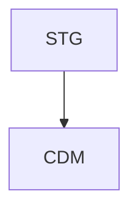
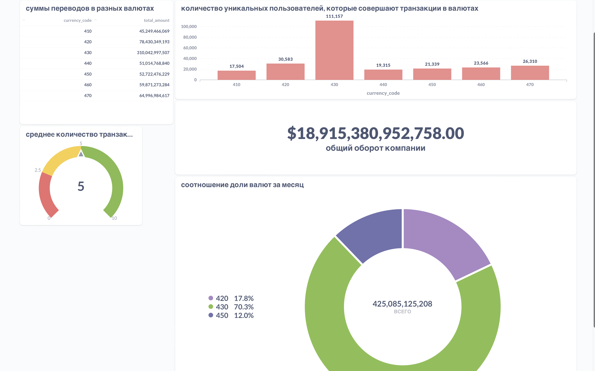

#  Разработка и реализация полноценного хранилища данных и пайплайна обработки информации для финтех-стартапа.

### Задача
Контекст работы компании:
- финтех-стартап, который предлагает международные банковские услуги через приложение: пользователи могут безопасно переводить деньги в разные страны.
- в каждой стране, где доступно приложение, есть отдельный сервис, работающий с валютой этой страны.
-  компания ведёт учёт транзакционной активности клиентов внутри и между странами: разработан единый протокол передачи данных, который обеспечивает одинаковую структуру таблиц во всех странах.

Описание задачи
- Команда аналитиков попросила собрать данные по транзакционной активности пользователей и настроить обновление таблицы с курсом валют.
- Цель — понять, как выглядит динамика оборота всей компании и что приводит к его изменениям.
### Описание
Цель проекта заключается в разработке и реализации полноценного хранилища данных и пайплайна обработки информации для финтех-стартапа, используя знания, полученные во всех предыдущих спринтах.

**2 источника данных** 
- Выгрузка данных из PostgreSQL и из S3. 
- Источник для данных transactions -  PostgreSQL.
- Источник для данных currencies - S3.
- Vertica в качестве DWH.
- Далее реализована загрузка данных в DWH с использованием DAG в Airflow.
Входные данные
- **transactions**
  - operation_id — id транзакции;
  - account_number_from — внутренний бухгалтерский номер счёта транзакции ОТ КОГО;
  - account_number_to — внутренний бухгалтерский номер счёта транзакции К КОМУ;
  - currency_code — трёхзначный код валюты страны, из которой идёт транзакция;
  - country — страна-источник транзакции;
  - status — статус проведения транзакции: queued («транзакция в очереди на обработку сервисом»), in_progress («транзакция в обработке»), blocked («транзакция заблокирована сервисом»), done («транзакция выполнена успешно»), chargeback («пользователь осуществил возврат по транзакции»).
  - transaction_type — тип транзакции во внутреннем учёте: authorisation («авторизационная транзакция, подтверждающая наличие счёта пользователя»), sbp_incoming («входящий перевод по системе быстрых платежей»), sbp_outgoing («исходящий перевод по системе быстрых платежей»), transfer_incoming («входящий перевод по счёту»), transfer_outgoing («исходящий перевод по счёту»), c2b_partner_incoming («перевод от юридического лица»), c2b_partner_outgoing («перевод юридическому лицу»).
  - amount — целочисленная сумма транзакции в минимальной единице валюты страны (копейка, цент, куруш);
  - transaction_dt — дата и время исполнения транзакции до миллисекунд.

- **сurrencies** 
  - date_update — дата обновления курса валют;
  - currency_code — трёхзначный код валюты транзакции;
  - currency_code_with — отношение другой валюты к валюте трёхзначного кода;
  - currency_code_div — значение отношения единицы одной валюты к единице валюты транзакции.

### OVSYANIKDMITRYYANDEXRU__DWH.GLOBAL_METRICS витрина данных
- **Целевая витрина `OVSYANIKDMITRYYANDEXRU__DWH.GLOBAL_METRICS`**
- `date_update` — дата расчёта,
- `currency_from` — код валюты транзакции;
- `amount_total` — общая сумма транзакций по валюте в долларах;
- `cnt_transactions` — общий объём транзакций по валюте;
- `avg_transactions_per_account` — средний объём транзакций с аккаунта;
- `cnt_accounts_make_transactions` — количество уникальных аккаунтов с совершёнными транзакциями по валюте.
### Уточнение по решению. 
Поскольку данные в источниках хранятся в "хорошем" состоянии, не нужно было строить несколько слоев хранилища данных для обраьотки и распределения этих данных. Поэтому было решено использовать простую модель данных Кимбалла,что ускорило процесс выполнения проекта.В проекте всего два слоя 'STG' - слой сырых данных,данные приходят As Is; 'CDM' слой витрин данных. 
Если бы условием было дальнейшее масштабирование системы, то тогда я бы использовал DataVault архитектуру DWH.

### Настроена BI-аналитика для компании. 
# Dashboard

Внутри `src` расположены папки:
- `/src/dags` - ETL-transaction-currencies-DAG.py +(updated)ETL-transaction-currencies-DAG-v2_updated.py  решение выполнено одним Дагом; так же решение можно реализовать и двумя.Такой подход был обусловлен рациональностью в решении. 
- `/src/sql` - SQL-запросы формирования таблиц в `STAGING`- и `DWH`-слоях + SQL запросы для ETL процесса;
- `/src/img` - скриншот реализованного над витриной дашборда.
